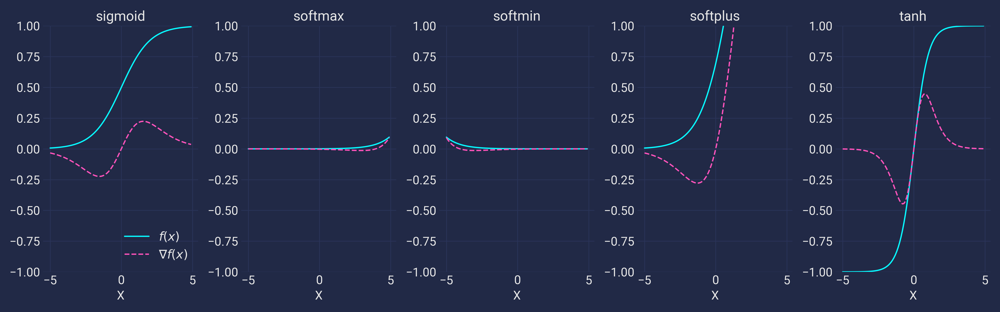

# Learning Neural Networks

This repository contains a series of notebooks that demonstrate fundamentals of deep learning
with varying degrees of abstraction. The idea is that each notebook covers a part of deep learning
not necessarily with specific purposes in mind, but to try and get the core theoretical concepts
without applying it to the usual problems like cat and handwriting classification.

## How to use these notebooks

I recommend opening this github repository in Google Colab—we get free computational power in
the form of free GPUs, why not use it? If you'd like to make modifications and really play
around with the notebooks however, I suggest you clone this repo and install the packages
specified in `requirements.txt`.

In terms of the natural progression of things, this is the general gist/summary of each notebook:

1. Fundamentals
  - Dive into _why_ we should use neural networks and deep learning
  - Low-level implementation of the core mechanics of neural networks, the perceptron
  - Effect of non-linearities on our model output
  - Teaching a neural network
