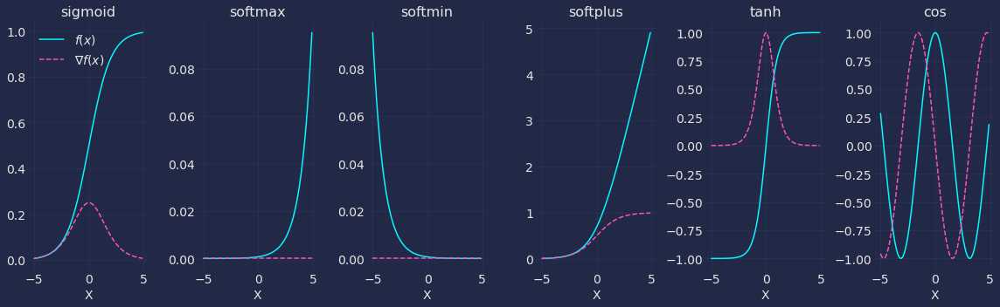

# Learning Neural Networks

This repository contains a series of notebooks that demonstrate fundamentals of deep learning
with varying degrees of abstraction. The idea is that each notebook covers a part of deep learning
not necessarily with specific purposes in mind, but to try and get the core theoretical concepts
without applying it to the usual problems like cat and handwriting classification.

## How to use these notebooks

For viewing and easy playing, the Binder button above will launch a Binder
image to try stuff out. I recommend opening this github repository in Google
Colab—we get free computational power in the form of free GPUs, why not use it?
You can get start up the notebooks [by navigating to this
link](https://colab.research.google.com/github/laserkelvin/learning-neural-networks).

If you'd like to make modifications and really play around with the notebooks
however, I suggest you clone this repo and install the packages specified in
`requirements.txt`.

In terms of the natural progression of things, this is the general gist/summary
of each notebook:

1. Fundamentals
  - Dive into _why_ we should use neural networks and deep learning 
  - Low-level implementation of the core mechanics of neural networks, the perceptron, using NumPy
  - Effect of non-linearities on our model output Teaching a neural network

## Acknowledgements

I created these notebooks while doing the
[deeplearning.ai](https://www.coursera.org/specializations/deep-learning)
specialization for deep learning. Andrew Ng and his team has put together a set
of great courses, and so some of the things I'm describing in my notebooks are
inspired (but not lifted!) from his videos.

